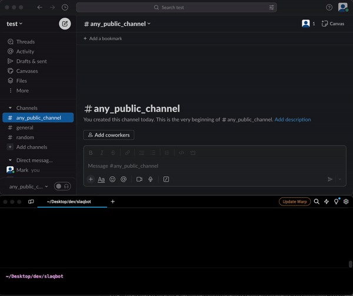

# Slaqbot
***Your Personal AI Assistant in Slack for Quick and Accurate Answers to FAQs***

This is a Slack bot that uses the OpenAI API to answer questions. It listens for a command in Slack, sends the command text to the OpenAI API, and then sends the API's response back to the user in a direct ephemeral message, so no matter the channel.

Regardless of the channel where the `/faq` command is issued form, both question and answer will only be visible for the given user on the given device until the next restart of the application. This is nice because it will not get logged or pollute channel/history.

## How it works

The bot uses the `slack_bolt` library to listen for the `/faq` command in Slack. When it receives such command, it calls the `handle_faq` function with the command text.

The `handle_faq` function sends the command text to the OpenAI API and waits for a response. It does this by calling the `ask_llm` function, which creates a new OpenAI thread, sends a message to the thread, and then retrieves the thread's response.

Once `handle_faq` has the OpenAI API's response, it sends a direct message to the user with the response. It does this by calling the `send_dm` function, which uses the `chat_postEphemeral` method from the `slack_bolt` library.

## How to set up
### Set up the app and bot in Slack
To set up the bot in your Slack workspace, you need to create a new Slack app and configure it using the provided `slack_app_manifest.yaml` file. Here's how you can do it:

1. Go to the [Slack API website](https://app.slack.com/apps) and click on the 'Create New App' button.

2. In the pop-up window, select 'From an app manifest'.

3. Choose the workspace where you want to install the bot.

4. You'll be taken to a page where you can input your app manifest. Copy the contents of the `slack_app_manifest.yaml` file and paste it into the input field.

5. Click on the 'Next' button. Slack will validate the manifest and show you a summary of the app configuration.

6. Review the configuration and click on the 'Create' button.

7. You'll be taken to the app's Basic Information page. Here, you can install the app to your workspace by clicking on the 'Install to Workspace' button.

8. After installing the app, you'll be given a Bot User OAuth Token. Save this token as you'll need it to run the bot.

The `slack_app_manifest.yaml` file configures the bot to always be online and to listen to the `/faq` slash command. When the slash command is used in any channel, the bot will receive the command text and respond with an answer from the OpenAI API.

### Setup the assistant in OpenAI

The `setup_openai_assistant.py` script provides a guide on how to set up the OpenAI assistant that the Slack bot will use to answer FAQs posted via the `/faq` command.

The script includes functions to create an assistant, create a file, and list all assistants. However, as the OpenAI assistant API is still in beta, it's recommended to set up the assistant via the OpenAI GUI and upload the reference file manually.

Here's how you can do it:

1. Go to the [OpenAI website](https://beta.openai.com/assistants/) and click on the 'New Assistant' button.

2. Fill in the details as shown in the `create_assistant` function in the script. For the instructions, use the text provided in the function. For the name, use "Slack FAQ Bot". For the model, use "gpt-3.5-turbo-1106".

3. After creating the assistant, you'll need to upload a reference file. This file should contain the FAQ articles that the assistant will use to answer questions. The file ID should be the same as the one used in the `create_file` function in the script. You can use the included `faq_example.yaml` for reference.

4. Once the assistant and the file are set up, you can use the `list_assistants` function in the script as a guide to view all your assistants.

Remember to save the assistant ID in the `.env` file as you'll need it to run the bot.

## How to run
After you've set up slack and OpenAI, you are ready to install python dependencies and run the tool

1. Use poerty and install the required Python libraries with `poetry install`.
2. Create a `.env` file according to the .env.exmaple and assign value to the necesarry variables.
3. Run the script with `poetry run python slaqbot.py`.
4. Test in your slack workspace by issuing the `/faq` command in any channel

## Note

This bot is asynchronous, meaning it can handle multiple commands at the same time without blocking. It uses Python's `asyncio` and `concurrent.futures` libraries to achieve this along with relevant built-in libraries from slack_bolt.